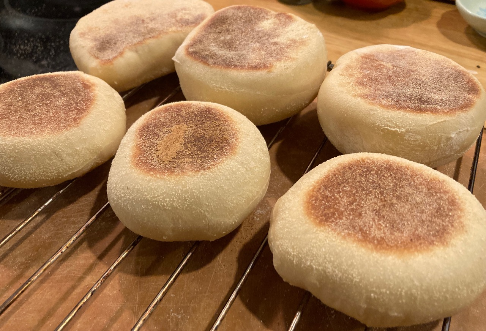
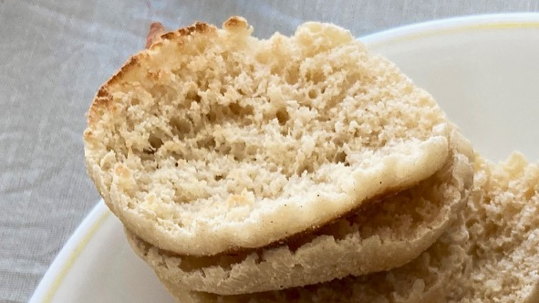
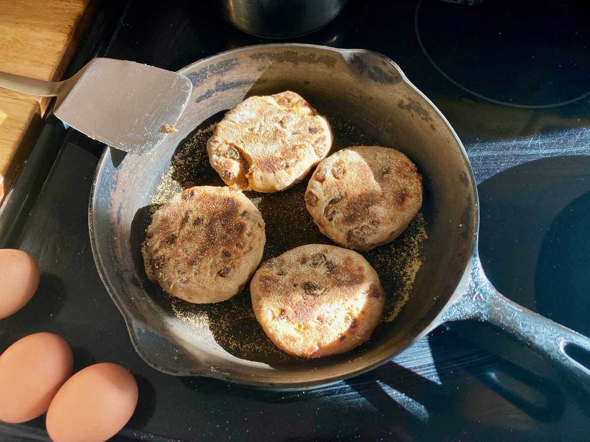

## Sourdough English Muffins

Modified form the non-sourdough [recipe](English.muffins.md) by Paul Hollywood, with replacement of the milk protein and flavor with milk powder at 0.133 g milk powder / ml milk in the original recipe.

Makes about 15 muffins.

### Ingredients

- 1.5 tsp active dried yeast
- 150 ml water, 110˚F
- 365 g all-purpose flour
- 1.5 tsp fine salt 
- 1.5 Tbsp powdered sugar 
- 26 g powdered milk
- 180 g fresh sourdough starter
- 23 g butter, softened
- 1 egg, lightly beaten
- semolina

### Special equipment

- a 8-cm round cutter

### Procedure

- [ ] Mix the yeast and warm water and a pinch of the sugar; incubate for 10 min
- [ ] Meanwhile, combine the flour, salt, remaining sugar and powdered milk
- [ ] Add the sourdough starter to the yeast solution
- [ ] Add the butter and beaten egg
- [ ] Combine the wet and dry mixtures to make the dough
- [ ] Turn it out and knead by hand for 10-15 minutes 
- [ ] Place in a buttered bowl and cover; proof 1-2 hour, until more than doubled in size
- [ ] Return to a floured work surface; roll out to 1.5 cm thick
- [ ] Cover a baking sheet in parchment paper and dust the surface with semolina
- [ ] Using an 8-cm round cutter, stamp out muffins
- [ ] Arrange muffins on the baking sheet; sprinkle them with semolina
- [ ] Rest for 30 min
- [ ] Cook on a griddle at low heat for 5-6 min
- [ ] Flip and cook another 5-6 min
- [ ] Cool on a wire rack

## Variations

### Cinnamon and raisins

Add:

- 1 1/2 tsp cinnamon
- 130 g raisins, chopped