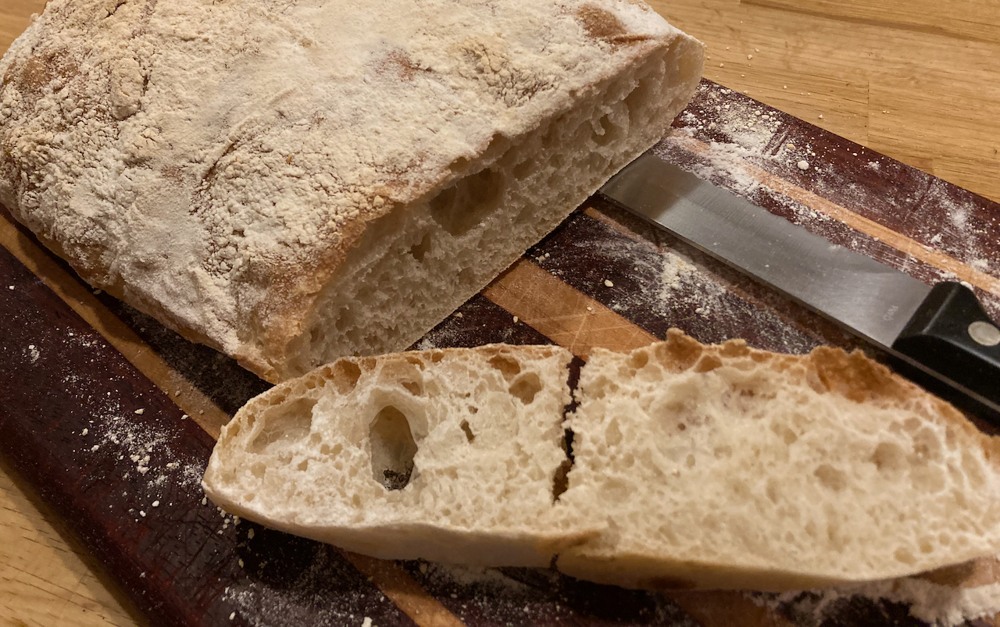

# bread

Recipes for bread and other foods.

## General tips

- **Start the yeast**. For any recipe using dry yeast, mix the yeast with warm water (about 110˚F). Let it stand for 5-10 min, until foamy. This will activate the yeast. Yeast can die in the refrigerator too, so be mindful of how old it is. If a recipe calls for sugar, adding a little of that at this stage can speed the process.
- In most recipes, **it's possible to substitute sourdough starter for flour and water**. For example 100 g of starter can replace 50 g water and 50 g flour. Be sure to keep at least 50 g of water in the recipe to start the yeast-- and it does seem wise to keep at least some dried yeast.
- **Knead by hand**. Really didn't understand how to do this correctly for a long time. Knead in such a way that you're folding the dough. Pull it away the stretch it out, then grab the far edge and fold it back. Turn the dough 90˚ and repeat. Ten to 15 minutes of this is typically adequate.
- **Proofing times** will vary based on temperature and any inhibitory ingredients. This process will be exponential, then plateau, causing the dough to collapse. Ideally, you want to end the proof while the yeast is still vigorous, after the dough has achieved the size you want and before any collapse. But you must consider both time and temperature. -- A [reference on proofing](https://challengerbreadware.com/bread-techniques/identifying-proofing-levels-in-baked-bread/). Advice: keep the dough somewhere warm, give it at least an hour, and watch it after that at 15-20 minute intervals.
- **In our convection oven**, it's usually necessary to cover bread to prevent the top from burning. 

## External links to some favorites

- [cheesy focaccia](https://www.kingarthurbaking.com/recipes/small-batch-cheesy-focaccia-recipe)
- [scallion pancakes](https://www.kingarthurbaking.com/recipes/quick-sourdough-herb-and-scallion-pancakes-recipe) with sourdough discard
- [cinnamon rolls](https://www.kingarthurbaking.com/recipes/soft-cinnamon-rolls-recipe)
- [Panettone](https://www.browneyedbaker.com/panettone-recipe/)
- 