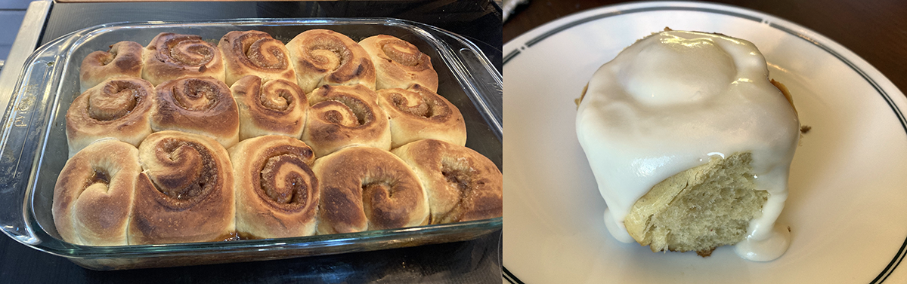
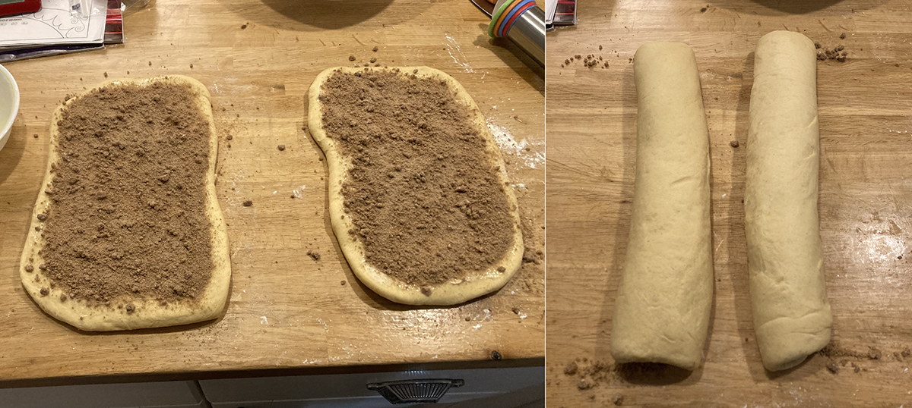

## Cardamom breakfast rolls

### Ingredients

#### tangzhong

- 71 g water
- 71 g whole milk
- 25 g bread flour

#### dough

- 525 g AP flour
- 11 g salt
- 1 Tbsp active dried yeast
- 170 g whole milk, room temperature
- 2 eggs, room temperature
- 0.5 tsp vanilla extract
- 5 Tbsp (70 g) unsalted butter, softened
- 2 Tbsp honey
- 2 tsp ground cardamom

#### filling

- 142 g brown sugar
- 2 tsp ground cardamom
- 0.25 tsp cinnamon
- 2 Tbsp (28 g) unsalted butter, softened

#### glaze

- 227 g (2 cups) confectioners' sugar
- pinch of table salt
- 28 g (2 Tbsp) butter, melted
- 1/2 tsp vanilla extract
- 2-3 Tbsp honey
- water as needed

### Procedure

####  tangzhong

- [ ] Add all the tangzhong ingredients together over medium heat, and constantly whisk until it becomes a paste.
- [ ] Once thick, remove from heat and let it cool to room temperature.

#### dough

- [ ] Start the yeast in the warm milk, and let sit for 10 minutes (ideally before starting the tangzhong).
- [ ] Mix the tangzhong with the remaining dough ingredients until everything comes together. Let the dough rest, covered, for 20 minutes.
- [ ] Knead the dough until it is smooth, elastic, somewhat sticky.
- [ ] Shape the dough into a ball, and let it rest in a lightly greased covered bowl for 60 to 90 minutes, until puffy but not necessarily doubled in bulk.
- [ ] Gently punch the dough down; place on a work surface. 
- [ ] Divide it in half, and shape each piece into a rough rectangle. Roll each piece into an 18" x 8" rectangle.

#### filling

- [ ] Combine the sugar and spice.
- [ ] Spread the softened butter evenly over the dough rectangles.
- [ ] Sprinkle the sugar mixture evenly over the dough.
- [ ] Starting with a long edge, roll the dough into a log. 
- [ ] With the seam underneath, cut the log into slices, 1 1/2" thick. Use string or dental floss to make the cut (not a knife).
- [ ] Lightly grease a 9" x 13" pan. Space the rolls in the pan.
- [ ] Cover the pan and let the rolls rise for 45 to 60 minutes, until they're puffy and crowding one another. 
- [ ] Bake at 350˚F for 22-25 minutes. Interior temperature should be about 188°F.

  > The final proof can alos be overnight in a refrigerator.

#### glaze

- [ ] Stir together the glaze ingredients, adding just enough of water to make it spreadable..
- [ ] Remove the rolls from the oven, and turn them out of the pan onto a wire rack. Spread them with the icing; it'll partially melt into the rolls.
- [ ] Serve the rolls warm. 

### Variations

#### Sourdough

Use sourdough starter with the following modifications:
- 375 g AP flour
- 30 g dried milk powder
- 300 g sourdough starter
- 20 g water or whole milk

