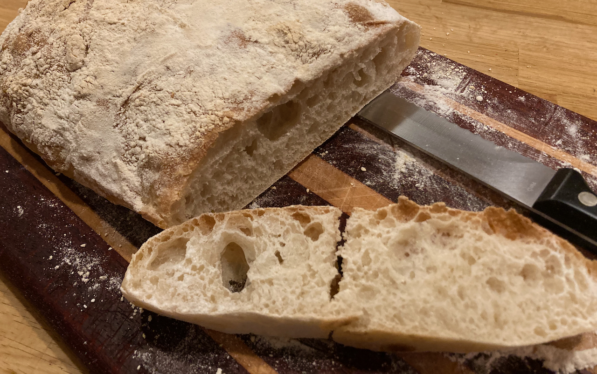

## Ciabatta

Based on a receipt from [Alexandra Cooks](https://alexandracooks.com/2021/06/26/how-to-make-ciabatta-bread/).

While there's a poolish in this version, it does not have an early overnight step. It also doesn't really knead the dough, instead using a "stretch and fold" technique. I've modified the proofing times for local conditions and yeast.

### Ingredients

#### For the Poolish

- 50 g (about 1/3 cup) bread flour
- 1/2 tsp instant yeast
- 50 g water, lukewarm or room temperature

#### For the Dough

- 360 g water, lukewarm or room temperature
- 12 g salt, kosher or sea salt
- 450 g bread flour, see notes above

### Preparation

- [ ] **Make the Poolish**. Combine the flour, yeast and water and stir. Cover and let stand at room temperature for 2-3 hours.
- [ ] **Make the Dough**. Add the water to the poolish. Add the salt and stir birefly. Add the flour and stir into a sticky ball.
- [ ] Cover and let stand for 20-30 minutes.
- [ ] **Stretch and fold:** With wet hands, grab one side of the dough, and pull up and to the center. Rotate the bowl a quarter turn, and repeat the grabbing and pulling. Do this until you’ve made a full circle. Then cover the bowl. If time permits, repeat this process three more times at 30-minute intervals for a total of 4 sets of stretches and folds over the course of two hours. 
- [ ] S&F #2
- [ ] S&F #3
- [ ] S&F #4
- [ ] Transfer to (ideally) a straight-sided container. Cover. Let it **rise** until doubled in size. 
- [ ] Deflate the dough. Return it to the container, and let it **rise again**. (This can be done overnight in the fridge.)
- [ ] Turn the dough out onto a work surface. Sprinkle your surface lightly with flour as needed to make the dough manageable. 
- [ ] Using a bench scraper or your hands, shape the dough into a tight ball. Optionally divide the dough in half, and ball up each portion.
- [ ] **Proof:** Sprinkle the countertop liberally with flour. Place the balls top-side (smooth side) down onto the flour. The seam-side will be on top now, and it may split open — this is fine. 
- [ ] Sprinkle the top surface of the balls liberally with flour. Cover with a tea towel and let rest for 1-2 hours. 
- [ ] **Preheat the oven to 425ºF**. 
- [ ] **Line a sheet pan with parchment paper.** When the dough has finished proofing, gently flip each loaf over, stretching slightly to achieve the classic rectangular slipper shape. Transfer to the prepared pan. 
- [ ] **Bake** for 25 minutes or until golden.
- [ ] Cool on a wire rack, at least 20 minutes before slicing. 

