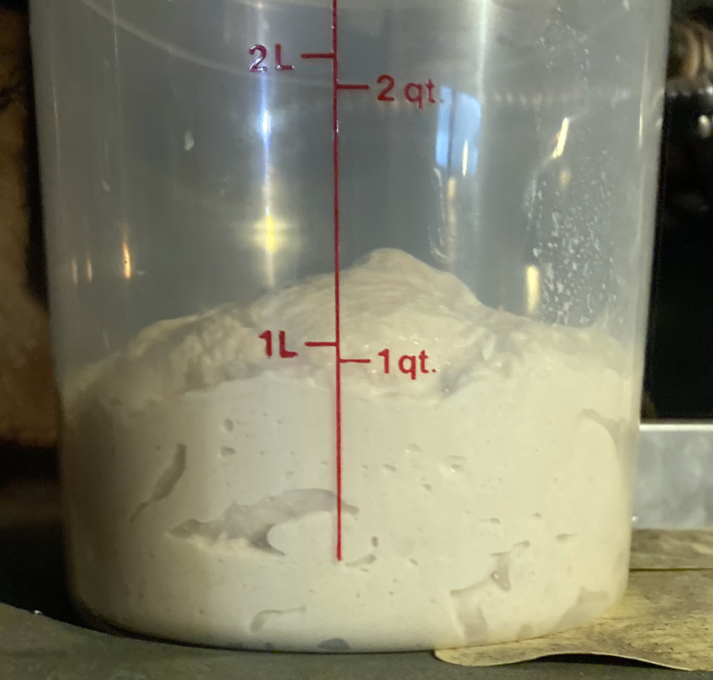

## Ciabatta

This recipe uses the stretch-and-fold  and tension-pull techniques and bakes in a Dutch oven.

### Ingredients

#### For the Poolish

- [ ] 50 g (about 1/3 cup) bread flour
- [ ] 1/2 tsp instant yeast
- [ ] 50 g water, lukewarm or room temperature

#### For the Dough

- [ ] 365 g water, lukewarm or room temperature
- [ ] 12 g salt, kosher or sea salt
- [ ] 20 g whole wheat flour
- [ ] 430 g bread flour

### Preparation

- **Make the Poolish**. Combine the flour, yeast and water and stir. Cover and let stand at room temperature for 2-3 hours.
- **Make the Dough**. Add the water to the poolish. Add the salt and stir birefly. Add the flour and stir into a sticky ball.
- Cover and let stand for 20-30 minutes.
- Ideally, transfer the dough to a transparent, straight-sided container.  

- **Stretch and fold:** With wet hands, grab one side of the dough, and gently lift it out of the container. Let gravity stretch it out. Then fold it back on itself. Rotate the dough a quarter turn, and repeat the grabbing and pulling. Do this until you’ve made a full circle. Return the dough to container. Repeat this process 3-4 more times at 30-minute intervals for a total of 4-5 sets of stretches and folds.
  - [ ] Stretch and fold 2
  - [ ] Stretch and fold 3
  - [ ] Stretch and fold 4
  - [ ] Stretch and fold 5
- Let it rise until doubled in size. 
- **Envelope fold**: Gently turn out the dough onto a clean, un-floured counter. Gently grab one side, stretch it out slightly, and fold it into the center. Repeat this with all four sides.
- Flip the dough over so the seams are against the counter and the smooth side is facing up.
- **Tension Pull:** Place your wet hands at the top and bottom of the dough, slightly tucked under. Gently drag the dough toward you without stretching it. Friction with tighten the surface of the dough. Rotate the dough 90 degrees and repeat. You will have enough tension when the surface looks smooth and taut. Stop immediately when it feels tight.
- Gently tuck the edges of the dough underneath to form a large, round boule.
- Cut two long pieces of parchment paper: just wide enough to cover the dough and long enough to extend across the Dutch oven. 
- Line a medium-sized mixing bowl or a proofing basket with the parchment pieces crossed. Dust the parchment surface with flour. Place the dough into the parchment-lined bowl. Cover it and let it rise for 1-2 hours.
- Preheat the Dutch Oven and lid to 450˚F for about 45 minutes.
- When the dough is puffy and an indentation from your finger springs back slowly, it is time to move it.
- Optionally, mist the surface with water and dust with semolina or seeds.
- Score the dough with a wet lame or serrate knife.
- Lift the dough (using the parchment paper sling) and lower the whole thing directly into the hot Dutch oven. Immediately put the hot lid back on and return it to the oven to bake.
- Bake for the first **20 minutes with the lid on**.
- Remove the lid and lower the oven to 425˚F for the final 15-20 minutes.
- Immediately move to a wire rack to cool for at least 2-3 hours before slicing. 

