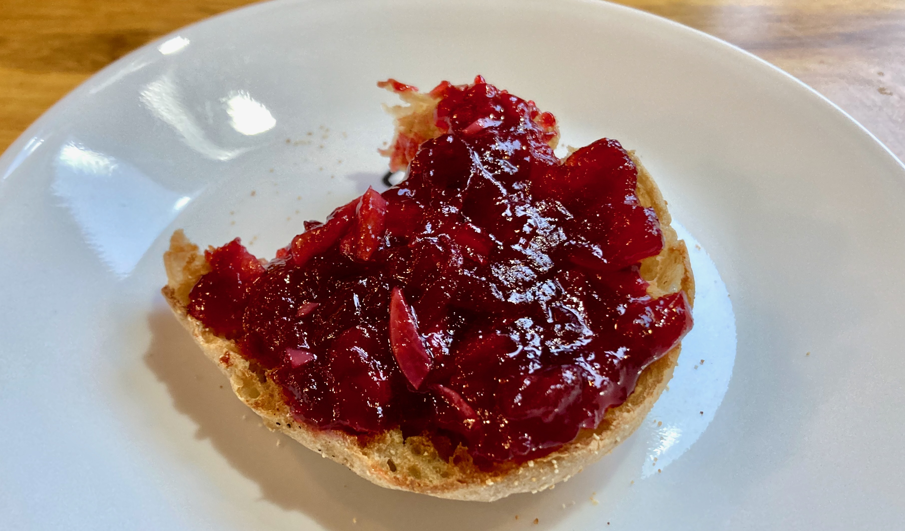

## Cranberry Chutney

Recipe attributed to Madhur Jaffrey, as [recounted by Susan Stamberg](https://www.npr.org/2023/11/17/1212912664/this-year-mama-stambergs-relish-shares-the-table-with-cranberry-chutney).

### Ingredients

- 1-inch piece fresh ginger
- 3 cloves finely chopped garlic
- 1/2 cup apple cider vinegar
- 4 tablespoons sugar
- 1/8 tsp cayenne pepper
- 1-pound cranberry sauce with berries
- 1/2 teaspoon salt (or less)
- ground black pepper

### Procedure

- [ ] Cut the ginger into thin slivers. 
- [ ] Combine ginger, garlic, vinegar, sugar and cayenne in a small pot, and simmer on medium about 15 minutes or until there are about four tablespoons of liquid left. 
- [ ] Add the cranberry sauce, salt and pepper. Mix and bring to a simmer. 
- [ ] Simmer on low for about 10 minutes. 
- [ ] Cool, store and refrigerate.