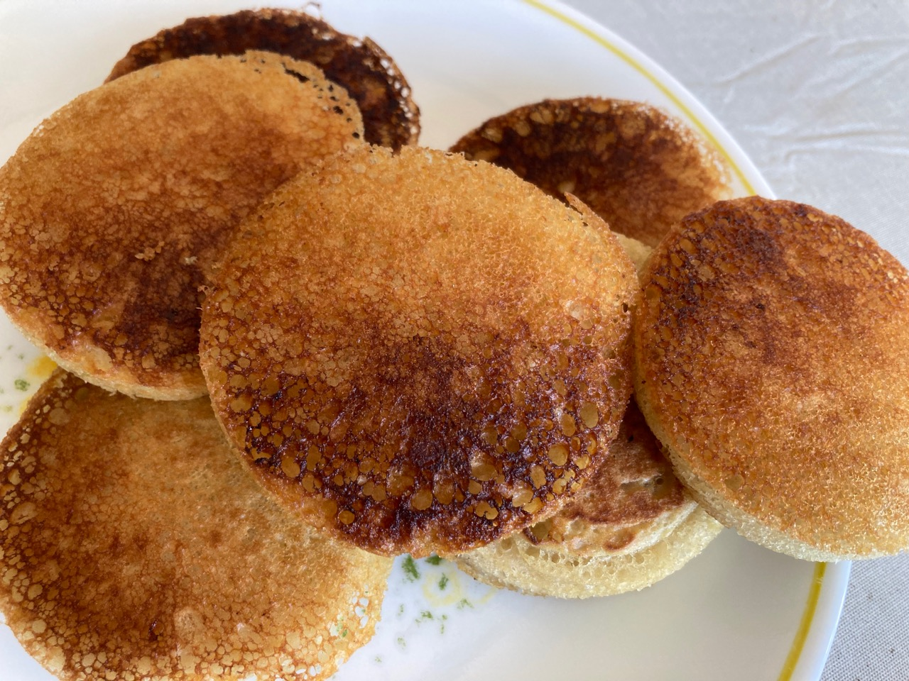

## Sourdough Crumpets

Inspired by [King Arthur](https://www.kingarthurbaking.com/recipes/sourdough-crumpets-recipe) and recommended by Alex Champion. If you don't the rings, just go without them. These are made in Australia where they're called pikelets.

### Ingredients

- 227 g (1 cup) unfed/discard sourdough starter
- 1 teaspoon sugar
- 1/4 teaspoon salt
- 3/8 teaspoon baking soda

### Special equipment

- 7-cm (2 1/2 inch) metal Mason jar rings (or English muffin rings)

### Procedure

- [ ] Combine all of the ingredients and mix by hand.
- [ ] Heat a skillet to medium (300˚F is ideal).
- [ ] Grease the pan with butter.
- [ ] Spray the interior of the metal rings with non-stick cooking spray and arrange them in the pan.
- [ ] Spoon about 60 ml (1/4 cup) of batter into each ring.
- [ ] Cook for about 5 min until the bubble for on the surface.
- [ ] Flip and cook another 3 min. 
