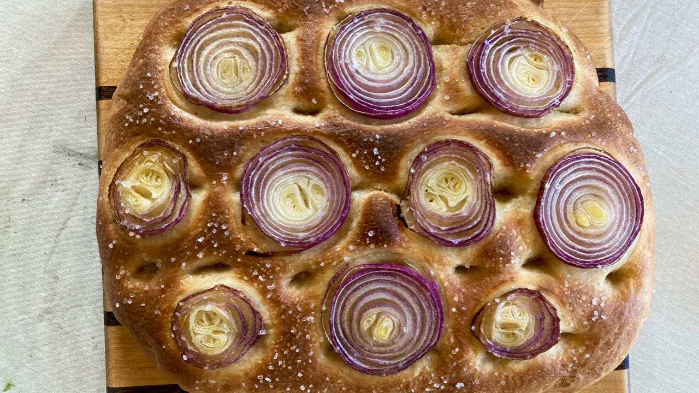

## Sourdough Focaccia

This version of focaccia takes a little longer to make, but it is much more flavorful! 

### Ingredients

- 170g ripe (fed) sourdough starter
- 170g  water at 105-110˚F
- 360g (about 3 cups) bread flour
- 37g olive oil
- 9g salt
- 43g honey
- 1 tablespoon instant yeast

### Preparation

- [ ] Mix the yeast , warm water and some of the honey in a large mixing bowl. Let stand for 10 min.
- [ ] Add the sourdough starter, then all the other dough ingredients
- [ ] Knead for 12 to 15 min
- [ ] Place the dough in a bowl that's been lightly coated with olive oil, cover, and rise for 60 min.
- [ ] Gently fold the dough over 3-4 times. Rise another 60 min.
- [ ] Turn our convection oven's rack into a baking tray: Line the interior with aluminum foil. 
- [ ] Coat the tray generously with olive oil. 
- [ ] Move the dough into the try and turn it over to coat it with oil.
- [ ] Gently stretch the dough into the edges and corners of the tray. As soon as the dough begins to shrink back, cover it, and let it rest for 10-15 min. Repeat as necessary, until the dough fills the tray.
- [ ] Cover the tray and transfer it to the refrigerator to let the dough rise overnight. (Alternatively, you can let it rise for at least 1 hour at room temperature and then bake. It may have less flavor this way, but you get bread sooner!)
- [ ] Remove the tray from the refrigerator and let it rest 30 min.
- [ ] Just before you're ready to bake, gently dimple the dough at irregular intervals with your fingers, pressing down firmly but not abruptly; you don't want to deflate the focaccia too much.
- [ ] Drizzle or brush about 2 tablespoons olive oil on top of there dough.
- [ ] Optionally, sprinkle with rosemary, flaked sea salt, or other herbs.
- [ ] Bake at 425˚F for 23 minutes, until light golden brown.
- [ ] Cool on a wire rack.

### Variations

**Pesto-stuffed Focaccia**: Before the last proof, stretch the dough into a rectangle about twice the width of the final shape. Spread a generous amount of pesto across half the dough and fold it over. Be sure the pesto is room temperature; not refrigerated.

**Breakfast Focaccia**: Instead of coating the dough with olive oil prior to baking, cover it with crumble topping.

- 95 g all-purpose flour
- 110 g brown sugar
- 65 g cropped pecans
- 82 g (6 Tbsp) butter, cold
- 3/8 tsp cinnamon
- 1/4 tsp salt

Chop the butter. Combine all the ingredients, and work the butter into the mix. 

