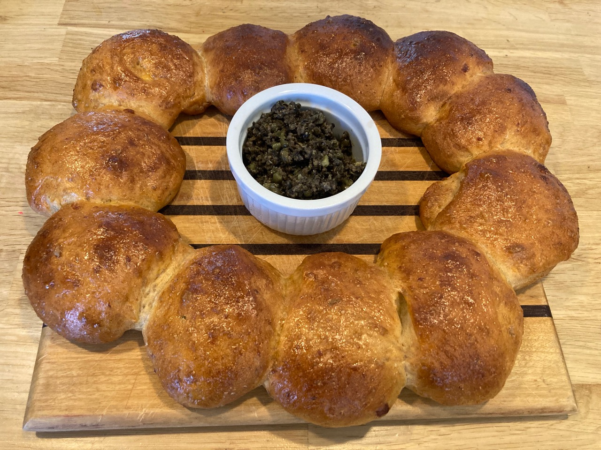

## Harissa yogurt bread

This recipe is quite an amalgam. It was initially inspired by [a silly recipe from Liam Charles](https://thegreatbritishbakeoff.co.uk/recipes/all/liam-charles-bear-and-share-bread/). I liked his use of yogurt, but wanted a yeast-risen harissa bread like that from [Chetna Makan](https://chetnamakan.co.uk/harissa-bread/). So this recipe incorporates ideas for a yogurt yeast bread from [Serious Eats](https://www.seriouseats.com/bread-baking-yogurt-and-honey-bread). Finally, the harissa recipe is modified from [The Minimalist Baker](https://minimalistbaker.com/easy-diy-harissa-paste/#wprm-recipe-container-40927). My first version included 20 g sunflower seeds, but it didn't seem to add anything (except protein, which is good too).

### Ingredients

For the dough:

- 350 g bread flour
- 1 tsp salt
- 1.5 tsp yeast
- 1 tsp smoked sweet paprika
- 40 g parmesan cheese, grated
- 330 g  yogurt
- 1 Tbsp harissa paste
- 1  egg, beaten for wash

For the tapenade:

- 160g black olives
- 1 tsp capers
- 1 anchovy fillet 
- 1 tsp red wine vinegar
- juice of one half lemon
- mint leaves to garnish

For the harissa:

- 4 bird's eye chilis
- 2 tsp cumin
- 1 tsp coriander 
- 0.5 tsp caraway seeds
- 2 cloves garlic, minced
- 1 tsp smoked paprika
- 0.5 tsp sea salt
- 15 ml lemon juice
- 7.5 ml white wine vinegar or apple cider vinegar
- 7.5 g tomato paste (or sub finely chopped sun-dried tomatoes)
- 30 ml olive oil

### Procedure

For the harissa:

- [ ] Combine cumin, coriander, and caraway seeds, minced garlic, smoked paprika, and salt. Then add lemon juice and vinegar and mix again until you’ve achieved a paste. Transfer paste to food processor and add the tomato paste.  (Optionally, try toasting the cumin and coriander in a dry pan.)
- [ ] Remove the stems and seeds from the chilis. Add to food processor. 
- [ ] Blend for 1-2 minutes, Slowly add the olive oil while blending. (Add more oil (or water) as needed until desired consistency is achieved.)
- [ ] Taste and adjust flavor as needed, adding more lemon or vinegar for acidity, paprika for smokiness, tomato paste for depth of flavor, or salt to taste. 
- [ ] Scoop paste into a jar to store in the refrigerator for up to 1 month. Or store in the freezer, in an ice cube tray, freezing, and storing in a freezer-safe container up to 2 months. Add cubes directly to warm foods (like stews or cooked sauces). 

For the dough:

- [ ] Microwave the yogurt to warm it to about 110˚F. On our microwave, it's about 90 seconds.
- [ ] Add about half the flour and all of the yeast. Stir to combine. Cover the bowl with plastic wrap and set aside for 20 minutes.
- [ ] Add the rest of the flour, salt, parmesan, sunflower seeds, paprika and harissa. 
- [ ] Knead with the dough hook until smooth and elastic, about 6-8 minutes. 
- [ ] Cover and proof until doubled in size, about 90 minutes.
- [ ] Tip the dough onto a lightly floured surface.
- [ ] Gently knead it to deflate.
- [ ] Shape the dough into two long sausages and cut each sausage into six even pieces. Shape into 12 even balls.
- [ ] Arrange the balls in a circle on a baking sheet. Leaving enough space to set your ramekin in the middle and making sure that the balls are only just touching each other. 
- [ ] Cover and proof again to the desired size, about 45-60 minutes.
- [ ] Brush with the beaten egg.
- [ ] Bake at 400°F for 25 minutes. Cover after about 10 min.
- [ ] Cool on a wire rack.

For the tapenade:

- [ ] Blitz all the ingredients in a food processor to form a smooth paste.
- [ ] Transfer the tapenade into a ramekin and place it in the centre of the ring.

